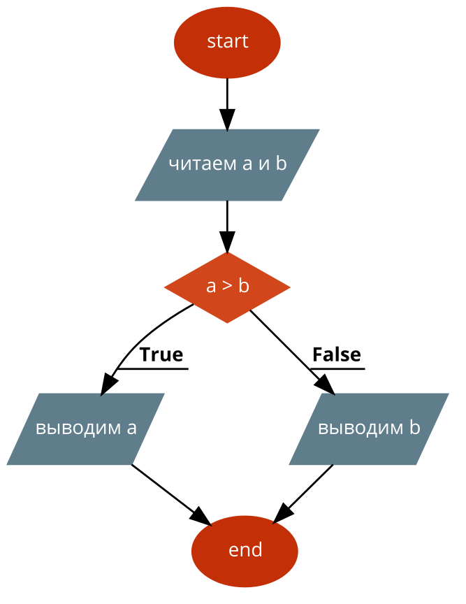

### Псевдокод и блоксхемы

* Псевдокод это компактный (зачастую неформальный) язык для описания алгоритмов, использующий ключевые слова языков программирования, но опускающий несущественные подробности и специфический синтаксис.
* Разные псевдокоды очень похожы на настоящие языки программирования, так как служат для описания алгоритмов программ.
* Блоксхемы (на англ. _flowchart_) это графическая альтернатива псевдокоду.
* [О псевдокоде в Википедии](https://ru.wikipedia.org/wiki/Псевдокод_(язык_описания_алгоритмов))
* [О блоксхемах в Википедии](https://ru.wikipedia.org/wiki/Блок-схема)

* В качестве примера рассмотрите псевдокод и блоксхемы, которые используется сервисом https://code2flow.com.

  * Пример псевдокода для выведения максимального из двух введеных чисел:
  ```
  start;

  /читаем a и b/;

  if (a > b) { 
  /выводим a/;
  }
  else{
  /выводим b/;
  }

  end;
  ```

  * Пример блоксхемы для выведения максимального из двух введеных чисел:
  
  


